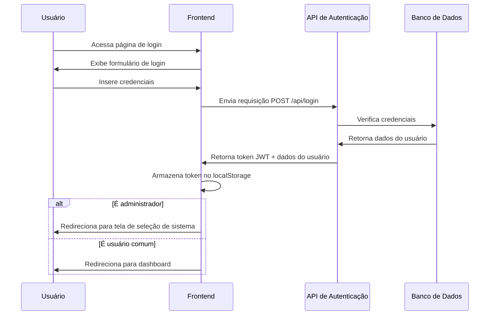
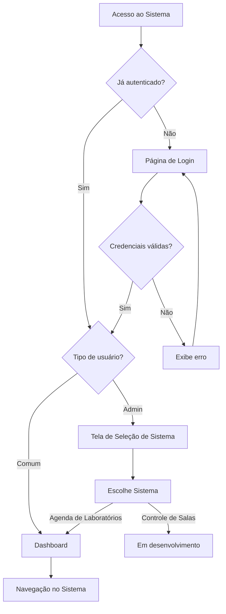

# 📘 Documentação Técnica Completa – Sistema de Agendamento de Laboratórios e Salas de Aula

## 🧾 Sumário

1. [Objetivo do Sistema](#1-objetivo-do-sistema)  
2. [Arquitetura Geral](#2-arquitetura-geral)  
3. [Perfis de Acesso e Fluxo Inicial](#3-perfis-de-acesso-e-fluxo-inicial)  
4. [Funcionalidades por Módulo](#4-funcionalidades-por-módulo)  
5. [Regras de Negócio](#5-regras-de-negócio)  
6. [Design e Usabilidade](#6-design-e-usabilidade)  
7. [Implementação Técnica](#7-implementação-técnica)  
8. [Segurança e Autenticação](#8-segurança-e-autenticação)  
9. [Estrutura de Dados](#9-estrutura-de-dados)  
10. [API e Endpoints](#10-api-e-endpoints)  
11. [Erros e Correções Recentes](#11-erros-e-correções-recentes)  
12. [Checklist de Validação Funcional](#12-checklist-de-validação-funcional)  
13. [Requisitos de Teste](#13-requisitos-de-teste)  
14. [Implantação e Manutenção](#14-implantação-e-manutenção)  
15. [Glossário Técnico](#15-glossário-técnico)  

---

## 1. Objetivo do Sistema

O Sistema de Agendamento de Laboratórios e Salas de Aula é uma plataforma integrada que visa otimizar a gestão de recursos educacionais através de dois módulos principais:

1. **Módulo de Agenda de Laboratórios** (implementado): Permite o gerenciamento completo de reservas de laboratórios, incluindo agendamento, visualização em calendário, controle de disponibilidade por turno e gerenciamento de usuários.

2. **Módulo de Controle de Ocupação de Salas de Aula** (em desenvolvimento): Focará no monitoramento e controle de ocupação das salas de aula regulares, com estatísticas de utilização e otimização de espaço.

O sistema foi projetado para atender instituições educacionais de diversos portes, desde escolas até universidades, permitindo que administradores e usuários comuns (professores, coordenadores) possam agendar e gerenciar recursos de forma eficiente, transparente e sem conflitos.

### 1.1 Objetivos Específicos

- Eliminar conflitos de agendamento através de validação em tempo real
- Fornecer visualização clara da disponibilidade de recursos por data, turno e horário
- Centralizar o gerenciamento de laboratórios e salas em uma única plataforma
- Permitir diferentes níveis de acesso e permissões
- Gerar relatórios de utilização para otimização de recursos
- Oferecer interface responsiva e intuitiva para todos os usuários

---

## 2. Arquitetura Geral

O sistema segue uma arquitetura cliente-servidor moderna, com separação clara entre frontend e backend, comunicação via API REST e persistência em banco de dados relacional.

### 2.1 Frontend

- **Tecnologias principais**:
  - HTML5, CSS3, JavaScript (ES6+)
  - Bootstrap 5.3.2 (framework CSS)
  - Bootstrap Icons 1.10.0 (biblioteca de ícones)
  - Componentes modulares para calendário, formulários e filtros
  - Manipulação do DOM via JavaScript puro

- **Estrutura de arquivos**:
  ```
  /src/static/
  ├── css/
  │   └── styles.css
  ├── js/
  │   └── app.js
  ├── admin-login.html
  ├── calendario.html
  ├── index.html
  ├── laboratorios-turmas.html
  ├── novo-agendamento.html
  ├── perfil.html
  ├── register.html
  ├── selecao-sistema.html
  └── usuarios.html
  ```

- **Padrões de design**:
  - Componentes reutilizáveis
  - Separação de responsabilidades (HTML para estrutura, CSS para apresentação, JS para comportamento)
  - Responsividade mobile-first
  - Feedback visual para ações do usuário

### 2.2 Backend

- **Tecnologias principais**:
  - Python 3.11+
  - Flask (framework web)
  - Flask-SQLAlchemy (ORM)
  - JWT para autenticação
  - Werkzeug para segurança

- **Estrutura de arquivos**:
  ```
  /src/
  ├── models/
  │   ├── __init__.py
  │   ├── agendamento.py
  │   ├── laboratorio_turma.py
  │   └── user.py
  ├── routes/
  │   ├── agendamento.py
  │   ├── laboratorio.py
  │   ├── notificacao.py
  │   ├── turma.py
  │   └── user.py
  └── main.py
  ```

- **Padrões de design**:
  - Arquitetura MVC (Model-View-Controller)
  - Injeção de dependências
  - Separação de rotas por domínio
  - Validação de entrada em camadas

### 2.3 Banco de Dados

- **Tecnologias suportadas**:
  - SQLite (desenvolvimento)
  - MySQL (produção)

- **Modelo de dados**:
  - Relacionamentos definidos via SQLAlchemy
  - Chaves estrangeiras para integridade referencial
  - Índices para otimização de consultas frequentes

- **Tabelas principais**:
  - `usuarios`: Armazena dados de usuários e credenciais
  - `laboratorios`: Cadastro de laboratórios disponíveis
  - `turmas`: Cadastro de turmas para agendamento
  - `agendamentos`: Registros de reservas com relações para laboratório, turma e usuário
  - `notificacoes`: Sistema de notificações para usuários
  - `turnos`: Definição de turnos disponíveis (manhã, tarde, noite)
  - `sistemas`: Registro de sistemas disponíveis na plataforma

### 2.4 Diagrama de Arquitetura

```
┌─────────────┐     ┌─────────────┐     ┌─────────────┐
│   Cliente   │     │   Servidor  │     │  Banco de   │
│  (Browser)  │◄────┤   (Flask)   │◄────┤    Dados    │
└─────────────┘     └─────────────┘     └─────────────┘
       │                   │                   │
       ▼                   ▼                   ▼
┌─────────────┐     ┌─────────────┐     ┌─────────────┐
│    HTML     │     │   Rotas     │     │   Tabelas   │
│    CSS      │     │  Modelos    │     │  Relações   │
│ JavaScript  │     │ Controladores│    │   Índices   │
└─────────────┘     └─────────────┘     └─────────────┘
```

---

## 3. Perfis de Acesso e Fluxo Inicial

### 3.1 Tipos de Usuários

#### 3.1.1 Administrador
- **Permissões**:
  - Acesso total ao sistema
  - Gerenciamento de usuários (criar, editar, excluir)
  - Gerenciamento de laboratórios e turmas
  - Visualização de todos os agendamentos
  - Acesso à tela de seleção de sistemas
  - Edição e exclusão de qualquer agendamento

- **Identificação**:
  - Campo `tipo` na tabela `usuarios` com valor "admin"
  - Token JWT com claim de tipo de usuário

#### 3.1.2 Usuário Comum
- **Permissões**:
  - Visualização do calendário de agendamentos
  - Criação de agendamentos próprios
  - Edição e exclusão apenas dos próprios agendamentos
  - Visualização do próprio perfil
  - Acesso direto ao módulo de Agenda de Laboratórios

- **Identificação**:
  - Campo `tipo` na tabela `usuarios` com valor "comum"
  - Token JWT com claim de tipo de usuário

### 3.2 Fluxo de Autenticação



### 3.3 Fluxo de Entrada (Login)

1. Usuário acessa a página de login (`admin-login.html`)
2. Sistema verifica se já existe um token válido no localStorage:
   - Se existir, verifica o tipo de usuário e redireciona adequadamente
   - Se não existir, exibe o formulário de login
3. Usuário insere credenciais (nome de usuário e senha)
4. Sistema valida as credenciais contra o backend
5. Em caso de sucesso:
   - Armazena o token JWT no localStorage
   - Armazena os dados básicos do usuário no localStorage
   - Verifica o tipo de usuário:
     - Se for administrador: redireciona para tela de seleção de sistema (`selecao-sistema.html`)
     - Se for usuário comum: redireciona diretamente para o dashboard (`index.html`)
6. Em caso de falha:
   - Exibe mensagem de erro apropriada
   - Mantém o usuário na página de login

### 3.4 Diagrama de Fluxo de Usuário



---

## 4. Funcionalidades por Módulo

### 4.1 Tela de Seleção de Sistema

- **Descrição**: Interface que permite aos administradores escolher entre os sistemas disponíveis na plataforma.
- **Arquivo**: `selecao-sistema.html`
- **Características**:
  - Exibição automática após login de administradores
  - Cards visuais para cada sistema disponível
  - Indicação clara de sistemas em desenvolvimento
  - Design responsivo e intuitivo

- **Componentes**:
  - Card "Agenda de Laboratórios" (clicável)
  - Card "Controle de Ocupação de Salas de Aula" (desabilitado, em desenvolvimento)
  - Navbar simplificada com opção de logout

- **Comportamento**:
  - Ao clicar no card "Agenda de Laboratórios", o usuário é redirecionado para o dashboard
  - O card "Controle de Ocupação de Salas de Aula" está desabilitado e exibe badge "Em desenvolvimento"

### 4.2 Dashboard (Página Inicial)

- **Descrição**: Página inicial do sistema com visão geral e acesso rápido às principais funcionalidades.
- **Arquivo**: `index.html`
- **Características**:
  - Resumo de agendamentos recentes
  - Notificações do usuário
  - Estatísticas de uso (para administradores)
  - Links rápidos para as principais funcionalidades

- **Componentes**:
  - Cards de resumo
  - Lista de notificações
  - Gráficos de utilização (para administradores)
  - Botões de ação rápida

### 4.3 Aba "Calendário"

- **Descrição**: Visualização em calendário de todos os agendamentos, com filtros e detalhamento.
- **Arquivo**: `calendario.html`
- **Características**:
  - Visualização mensal dos agendamentos
  - Diferenciação visual por cores de turno:
    - Manhã: Azul-claro (#FFE066)
    - Tarde: Laranja (#FFA94D)
    - Noite: Azul-escuro (#748FFC)
  - Filtros por laboratório e turno
  - Modal de detalhes ao clicar em um agendamento
  - Navegação entre meses

- **Componentes**:
  - Calendário mensal com grid de dias
  - Filtros laterais (desktop) e superiores (mobile)
  - Legenda de cores por turno
  - Modal de detalhes de agendamento
  - Modal de confirmação para exclusão

- **Comportamento**:
  - Ao carregar, exibe o mês atual com todos os agendamentos
  - Permite filtrar por laboratório e turno
  - Ao clicar em um agendamento, exibe modal com detalhes
  - Permite editar ou excluir agendamentos (conforme permissões)
  - Navegação entre meses com botões anterior/próximo

### 4.4 Aba "Novo Agendamento"

- **Descrição**: Formulário para criação de novos agendamentos com validação em tempo real.
- **Arquivo**: `novo-agendamento.html`
- **Características**:
  - Seleção de laboratório, turma, data e turno
  - Seleção dinâmica de horários disponíveis
  - Validação em tempo real de conflitos
  - Horários já reservados aparecem desabilitados

- **Componentes**:
  - Formulário de agendamento
  - Seletores de laboratório e turma (populados dinamicamente)
  - Seletor de data com calendário
  - Seletor de turno (Manhã, Tarde, Noite)
  - Lista de horários disponíveis

- **Comportamento**:
  - Ao selecionar laboratório, data e turno, verifica disponibilidade
  - Horários já reservados aparecem desabilitados e com etiqueta "Ocupado"
  - Validação em tempo real antes de submeter o formulário
  - Feedback visual após criação bem-sucedida

### 4.5 Aba "Laboratórios e Turmas"

- **Descrição**: Interface para administradores gerenciarem laboratórios e turmas disponíveis no sistema.
- **Arquivo**: `laboratorios-turmas.html`
- **Características**:
  - Acesso exclusivo para administradores
  - Duas seções: Laboratórios e Turmas
  - CRUD completo para ambas as entidades
  - Feedback visual para ações

- **Componentes**:
  - Formulários de cadastro
  - Tabelas de listagem
  - Botões de edição e exclusão
  - Modais de confirmação

- **Comportamento**:
  - Ao carregar, lista todos os laboratórios e turmas cadastrados
  - Permite adicionar novos registros via formulário
  - Permite editar registros existentes
  - Solicita confirmação antes de excluir registros
  - Atualiza listas automaticamente após operações

### 4.6 Aba "Usuários"

- **Descrição**: Interface para administradores gerenciarem usuários do sistema.
- **Arquivo**: `usuarios.html`
- **Características**:
  - Acesso exclusivo para administradores
  - Listagem de todos os usuários
  - CRUD completo de usuários
  - Definição de tipo de usuário (admin/comum)

- **Componentes**:
  - Formulário de cadastro de usuário
  - Tabela de listagem de usuários
  - Botões de edição e exclusão
  - Modal de confirmação

- **Comportamento**:
  - Ao carregar, lista todos os usuários cadastrados
  - Permite adicionar novos usuários
  - Permite editar dados e tipo de usuários existentes
  - Solicita confirmação antes de excluir usuários
  - Atualiza lista automaticamente após operações

### 4.7 Aba "Perfil"

- **Descrição**: Página para visualização e edição dos dados do próprio usuário.
- **Arquivo**: `perfil.html`
- **Características**:
  - Visualização dos dados do usuário logado
  - Edição de dados pessoais
  - Alteração de senha
  - Histórico de agendamentos do usuário

- **Componentes**:
  - Formulário de dados pessoais
  - Formulário de alteração de senha
  - Lista de agendamentos do usuário
  - Estatísticas de uso

- **Comportamento**:
  - Ao carregar, exibe os dados do usuário logado
  - Permite editar dados pessoais
  - Validação de segurança para alteração de senha
  - Exibe histórico de agendamentos do usuário

---

## 5. Regras de Negócio

### 5.1 Regras de Agendamento

1. **Disponibilidade de Horários**:
   - Um horário é considerado disponível apenas quando não existe nenhum agendamento para o mesmo laboratório, na mesma data e no mesmo turno.
   - Cada laboratório pode ter apenas um agendamento por horário.

2. **Vinculação de Agendamentos**:
   - Todo agendamento deve estar vinculado a:
     - Um laboratório existente
     - Uma turma existente
     - Um usuário responsável
     - Uma data válida (não retroativa)
     - Um turno específico (Manhã, Tarde ou Noite)
     - Um ou mais horários dentro do turno selecionado

3. **Pré-requisitos para Agendamento**:
   - Laboratórios e turmas devem estar previamente cadastrados no sistema.
   - O usuário deve estar autenticado para realizar agendamentos.
   - Administradores podem agendar para qualquer laboratório e turma.
   - Usuários comuns podem agendar apenas para as turmas às quais têm acesso.

4. **Edição e Exclusão**:
   - Usuários comuns podem editar ou excluir apenas seus próprios agendamentos.
   - Administradores podem editar ou excluir qualquer agendamento.
   - Não é permitido editar um agendamento para um horário já ocupado.

### 5.2 Regras de Acesso

1. **Autenticação**:
   - Todo acesso ao sistema requer autenticação prévia.
   - Tokens JWT são utilizados para manter a sessão do usuário.
   - Tokens expiram após 24 horas de inatividade.

2. **Autorização**:
   - Apenas administradores podem acessar:
     - Tela de seleção de sistema
     - Gerenciamento de usuários
     - Gerenciamento de laboratórios e turmas
   - Usuários comuns têm acesso restrito a:
     - Dashboard
     - Calendário
     - Criação de agendamentos
     - Edição do próprio perfil

3. **Seleção de Sistema**:
   - Apenas administradores visualizam a tela de seleção de sistema.
   - Usuários comuns são redirecionados diretamente para o dashboard.

### 5.3 Regras de Validação

1. **Validação de Formulários**:
   - Todos os campos obrigatórios devem ser preenchidos.
   - Datas de agendamento não podem ser retroativas.
   - Senhas devem ter no mínimo 8 caracteres, incluindo letras e números.
   - Nomes de usuário devem ser únicos no sistema.

2. **Validação de Conflitos**:
   - O sistema verifica em tempo real a disponibilidade de horários.
   - Não é possível submeter um agendamento com conflito de horário.
   - Feedback visual é fornecido para horários indisponíveis.

---

## 6. Design e Usabilidade

### 6.1 Princípios de Design

- **Clareza**: Interface limpa e organizada, com hierarquia visual clara.
- **Consistência**: Padrões visuais e de interação consistentes em todo o sistema.
- **Feedback**: Respostas visuais claras para todas as ações do usuário.
- **Eficiência**: Fluxos otimizados para reduzir o número de cliques necessários.
- **Acessibilidade**: Contraste adequado, textos legíveis e suporte a tecnologias assistivas.

### 6.2 Paleta de Cores

- **Cores Primárias**:
  - Azul primário: #0d6efd (links, botões principais)
  - Cinza secundário: #6c757d (textos secundários, bordas)

- **Cores de Estado**:
  - Sucesso: #198754 (confirmações, ações bem-sucedidas)
  - Perigo: #dc3545 (exclusões, erros)
  - Alerta: #ffc107 (avisos, atenção)
  - Info: #0dcaf0 (informações, dicas)

- **Cores de Turno**:
  - Manhã: #FFE066 (amarelo-claro)
  - Tarde: #FFA94D (laranja)
  - Noite: #748FFC (azul-escuro)

### 6.3 Tipografia

- **Família principal**: 'Segoe UI', Tahoma, Geneva, Verdana, sans-serif
- **Tamanhos**:
  - Títulos principais: 1.75rem - 2.5rem
  - Subtítulos: 1.25rem - 1.5rem
  - Corpo de texto: 1rem
  - Texto secundário: 0.875rem
  - Legendas: 0.75rem

### 6.4 Componentes de Interface

- **Navegação**:
  - Navbar superior fixa com links principais
  - Sidebar lateral em telas grandes
  - Menu hambúrguer em telas pequenas
  - Breadcrumbs para navegação hierárquica

- **Formulários**:
  - Labels claros e associados aos campos
  - Validação em tempo real com feedback visual
  - Botões de ação com ícones e texto descritivo
  - Agrupamento lógico de campos relacionados

- **Calendário**:
  - Grid responsivo com dias do mês
  - Indicadores visuais para o dia atual
  - Eventos coloridos por turno
  - Rolagem vertical dentro das células para múltiplos eventos

- **Feedback**:
  - Alertas temporários para confirmações e erros
  - Tooltips para informações adicionais
  - Spinners para operações assíncronas
  - Modais para confirmações importantes

### 6.5 Responsividade

- **Breakpoints**:
  - Extra pequeno: < 576px (smartphones)
  - Pequeno: ≥ 576px (smartphones na horizontal)
  - Médio: ≥ 768px (tablets)
  - Grande: ≥ 992px (desktops)
  - Extra grande: ≥ 1200px (desktops grandes)

- **Adaptações**:
  - Sidebar se transforma em navbar em telas pequenas
  - Calendário ajusta tamanho das células conforme a tela
  - Formulários empilham campos em telas pequenas
  - Tabelas ganham rolagem horizontal em telas pequenas

---

## 7. Implementação Técnica

### 7.1 Estrutura de Arquivos Frontend

```
/src/static/
├── css/
│   └── styles.css          # Estilos globais do sistema
├── js/
│   └── app.js              # JavaScript global com funções comuns
├── admin-login.html        # Página de login
├── calendario.html         # Visualização de calendário
├── index.html              # Dashboard/página inicial
├── laboratorios-turmas.html # Gerenciamento de laboratórios e turmas
├── novo-agendamento.html   # Formulário de novo agendamento
├── perfil.html             # Perfil do usuário
├── register.html           # Página de registro
├── selecao-sistema.html    # Seleção de sistema (admin)
└── usuarios.html           # Gerenciamento de usuários
```

### 7.2 Estrutura de Arquivos Backend

```
/src/
├── models/                 # Modelos de dados (SQLAlchemy)
│   ├── __init__.py         # Inicialização do SQLAlchemy
│   ├── agendamento.py      # Modelo de agendamentos
│   ├── laboratorio_turma.py # Modelos de laboratórios e turmas
│   └── user.py             # Modelo de usuários
├── routes/                 # Rotas da API
│   ├── agendamento.py      # Endpoints de agendamentos
│   ├── laboratorio.py      # Endpoints de laboratórios
│   ├── notificacao.py      # Endpoints de notificações
│   ├── turma.py            # Endpoints de turmas
│   └── user.py             # Endpoints de usuários e autenticação
└── main.py                 # Ponto de entrada da aplicação
```

### 7.3 Principais Funções JavaScript

#### 7.3.1 Autenticação

```javascript
// Realiza o login do usuário
async function realizarLogin(username, senha) {
    try {
        const response = await fetch(`${API_URL}/login`, {
            method: 'POST',
            headers: { 'Content-Type': 'application/json' },
            body: JSON.stringify({ username, senha })
        });

        const data = await response.json();
        
        if (!response.ok) {
            throw new Error(data.erro || 'Erro ao realizar login');
        }
        
        // Armazena os dados do usuário no localStorage
        localStorage.setItem('token', data.token);
        localStorage.setItem('usuario', JSON.stringify(data.usuario));
        
        // Redireciona com base no tipo de usuário
        if (data.usuario.tipo === 'admin') {
            window.location.href = '/selecao-sistema.html';
        } else {
            window.location.href = '/index.html';
        }
        
        return data;
    } catch (error) {
        console.error('Erro no login:', error);
        throw error;
    }
}

// Verifica se o usuário está autenticado
function estaAutenticado() {
    return localStorage.getItem('token') !== null;
}

// Verifica se o usuário é administrador
function isAdmin() {
    const usuario = getUsuarioLogado();
    return usuario && usuario.tipo === 'admin';
}
```

#### 7.3.2 Comunicação com API

```javascript
// Realiza chamadas à API com autenticação
async function chamarAPI(endpoint, method = 'GET', body = null) {
    const token = localStorage.getItem('token');
    
    if (!token) {
        console.error('Token não encontrado. Redirecionando para login...');
        realizarLogout();
        throw new Error('Não autenticado');
    }
    
    const headers = {
        'Content-Type': 'application/json',
        'Authorization': `Bearer ${token}`
    };
    
    // Garante que o endpoint comece com /
    const endpointFormatado = endpoint.startsWith('/') ? endpoint : `/${endpoint}`;
    const url = `${API_URL}${endpointFormatado}`;
    
    const options = {
        method,
        headers
    };
    
    if (body && (method === 'POST' || method === 'PUT')) {
        options.body = JSON.stringify(body);
    }
    
    try {
        const response = await fetch(url, options);
        
        // Se o erro for de autenticação, faz logout imediatamente
        if (response.status === 401) {
            console.error('Erro de autenticação. Redirecionando para login...');
            realizarLogout();
            throw new Error('Não autenticado');
        }
        
        const data = await response.json();
        
        if (!response.ok) {
            throw new Error(data.erro || `Erro ${response.status}`);
        }
        
        return data;
    } catch (error) {
        console.error(`Erro na chamada à API ${url}:`, error);
        throw error;
    }
}
```

#### 7.3.3 Gerenciamento de Calendário

```javascript
// Atualiza o calendário com os agendamentos do mês atual
async function atualizarCalendario() {
    try {
        // Atualiza o título do mês/ano
        const meses = ['Janeiro', 'Fevereiro', 'Março', 'Abril', 'Maio', 'Junho', 'Julho', 'Agosto', 'Setembro', 'Outubro', 'Novembro', 'Dezembro'];
        document.getElementById('mesAnoAtual').textContent = `${meses[mesAtual]} ${anoAtual}`;
        
        // Carrega os agendamentos do mês
        agendamentos = await chamarAPI(`/agendamentos/calendario/${mesAtual + 1}/${anoAtual}`);
        
        // Aplica filtros se necessário
        if (filtroLaboratorio || filtroTurno) {
            agendamentos = agendamentos.filter(agendamento => {
                let passaFiltro = true;
                
                if (filtroLaboratorio && agendamento.laboratorio !== filtroLaboratorio) {
                    passaFiltro = false;
                }
                
                if (filtroTurno && agendamento.turno !== filtroTurno) {
                    passaFiltro = false;
                }
                
                return passaFiltro;
            });
        }
        
        // Gera o calendário
        gerarCalendario(mesAtual, anoAtual);
        
        // Preenche os agendamentos no calendário
        preencherAgendamentos();
    } catch (error) {
        console.error('Erro ao atualizar calendário:', error);
        exibirAlerta('Erro ao carregar agendamentos. Tente novamente mais tarde.', 'danger');
    }
}

// Preenche os agendamentos no calendário
function preencherAgendamentos() {
    // Limpa os agendamentos existentes
    document.querySelectorAll('.agendamentos-container').forEach(container => {
        container.innerHTML = '';
    });
    
    // Adiciona os agendamentos ao calendário
    agendamentos.forEach(agendamento => {
        const data = new Date(agendamento.data);
        const dia = data.getDate();
        
        // Encontra o container do dia
        const diaElement = document.querySelector(`.calendario-day[data-dia="${dia}"]`);
        if (!diaElement) return;
        
        const agendamentosContainer = diaElement.querySelector('.agendamentos-container');
        
        // Cria o elemento do agendamento
        const agendamentoElement = document.createElement('div');
        agendamentoElement.className = `agendamento-item ${getClasseTurno(agendamento.turno)}`;
        agendamentoElement.setAttribute('data-id', agendamento.id);
        agendamentoElement.setAttribute('title', `${agendamento.laboratorio} - ${agendamento.turma} - ${agendamento.turno}`);
        agendamentoElement.textContent = `${agendamento.laboratorio} - ${agendamento.turma}`;
        
        // Adiciona evento de clique
        agendamentoElement.addEventListener('click', () => mostrarDetalhesAgendamento(agendamento));
        
        // Adiciona ao container
        agendamentosContainer.appendChild(agendamentoElement);
    });
}

// Retorna a classe CSS correspondente ao turno
function getClasseTurno(turno) {
    switch (turno) {
        case 'Manhã':
            return 'agendamento-manha';
        case 'Tarde':
            return 'agendamento-tarde';
        case 'Noite':
            return 'agendamento-noite';
        default:
            return '';
    }
}
```

### 7.4 Principais Rotas da API

#### 7.4.1 Autenticação

```python
@user_bp.route('/login', methods=['POST'])
def login():
    data = request.get_json()
    username = data.get('username')
    senha = data.get('senha')
    
    if not username or not senha:
        return jsonify({'erro': 'Nome de usuário e senha são obrigatórios'}), 400
    
    usuario = Usuario.query.filter_by(username=username).first()
    
    if not usuario or not check_password_hash(usuario.senha_hash, senha):
        return jsonify({'erro': 'Credenciais inválidas'}), 401
    
    # Gera o token JWT
    token_payload = {
        'sub': usuario.id,
        'tipo': usuario.tipo,
        'exp': datetime.utcnow() + timedelta(hours=24)
    }
    token = jwt.encode(token_payload, current_app.config['SECRET_KEY'], algorithm='HS256')
    
    return jsonify({
        'token': token,
        'usuario': {
            'id': usuario.id,
            'nome': usuario.nome,
            'username': usuario.username,
            'email': usuario.email,
            'tipo': usuario.tipo
        }
    }), 200
```

#### 7.4.2 Agendamentos

```python
@agendamento_bp.route('/calendario/<int:mes>/<int:ano>', methods=['GET'])
@jwt_required
def get_agendamentos_calendario(mes, ano):
    # Verifica se o mês e ano são válidos
    if mes < 1 or mes > 12 or ano < 2000 or ano > 2100:
        return jsonify({'erro': 'Mês ou ano inválidos'}), 400
    
    # Define o intervalo de datas para o mês
    data_inicio = date(ano, mes, 1)
    if mes == 12:
        data_fim = date(ano + 1, 1, 1) - timedelta(days=1)
    else:
        data_fim = date(ano, mes + 1, 1) - timedelta(days=1)
    
    # Consulta os agendamentos no intervalo de datas
    agendamentos = Agendamento.query.filter(
        Agendamento.data >= data_inicio,
        Agendamento.data <= data_fim
    ).all()
    
    # Serializa os agendamentos
    resultado = []
    for agendamento in agendamentos:
        resultado.append({
            'id': agendamento.id,
            'laboratorio': agendamento.laboratorio.nome,
            'turma': agendamento.turma.nome,
            'data': agendamento.data.isoformat(),
            'turno': agendamento.turno,
            'horarios': agendamento.horarios,
            'usuario_id': agendamento.usuario_id,
            'usuario_nome': agendamento.usuario.nome
        })
    
    return jsonify(resultado), 200

@agendamento_bp.route('/verificar-disponibilidade', methods=['POST'])
@jwt_required
def verificar_disponibilidade():
    data = request.get_json()
    laboratorio_id = data.get('laboratorio_id')
    data_agendamento = data.get('data')
    turno = data.get('turno')
    
    if not laboratorio_id or not data_agendamento or not turno:
        return jsonify({'erro': 'Todos os campos são obrigatórios'}), 400
    
    # Converte a data de string para objeto date
    try:
        data_obj = date.fromisoformat(data_agendamento)
    except ValueError:
        return jsonify({'erro': 'Formato de data inválido'}), 400
    
    # Verifica se já existem agendamentos para o laboratório, data e turno
    agendamentos_existentes = Agendamento.query.filter(
        Agendamento.laboratorio_id == laboratorio_id,
        Agendamento.data == data_obj,
        Agendamento.turno == turno
    ).all()
    
    # Obtém os horários já ocupados
    horarios_ocupados = []
    for agendamento in agendamentos_existentes:
        try:
            horarios = json.loads(agendamento.horarios)
            horarios_ocupados.extend(horarios)
        except:
            horarios_ocupados.append(agendamento.horarios)
    
    # Define todos os horários possíveis para o turno
    todos_horarios = {
        'Manhã': ['07:30 - 08:20', '08:20 - 09:10', '09:10 - 10:00', '10:20 - 11:10', '11:10 - 12:00'],
        'Tarde': ['13:30 - 14:20', '14:20 - 15:10', '15:10 - 16:00', '16:20 - 17:10', '17:10 - 18:00'],
        'Noite': ['18:30 - 19:20', '19:20 - 20:10', '20:10 - 21:00', '21:10 - 22:00']
    }
    
    # Filtra os horários disponíveis
    horarios_disponiveis = [h for h in todos_horarios.get(turno, []) if h not in horarios_ocupados]
    
    return jsonify({
        'horarios_disponiveis': horarios_disponiveis,
        'horarios_ocupados': horarios_ocupados
    }), 200
```

---

## 8. Segurança e Autenticação

### 8.1 Autenticação JWT

O sistema utiliza JSON Web Tokens (JWT) para autenticação, seguindo as melhores práticas de segurança:

- **Geração de Token**: Tokens são gerados no backend após validação de credenciais.
- **Armazenamento**: Tokens são armazenados no localStorage do navegador.
- **Estrutura do Token**:
  - **Header**: Algoritmo de assinatura (HS256)
  - **Payload**:
    - `sub`: ID do usuário
    - `tipo`: Tipo de usuário (admin/comum)
    - `exp`: Data de expiração (24 horas após emissão)
  - **Signature**: Assinatura HMAC SHA-256 com chave secreta

- **Fluxo de Autenticação**:
  1. Usuário envia credenciais (username/senha)
  2. Backend valida credenciais contra o banco de dados
  3. Se válidas, gera token JWT com payload apropriado
  4. Frontend armazena token no localStorage
  5. Todas as requisições subsequentes incluem o token no header Authorization

- **Validação de Token**:
  - Middleware `jwt_required` verifica a presença e validade do token
  - Tokens expirados são rejeitados automaticamente
  - Tokens inválidos resultam em erro 401 (Unauthorized)

### 8.2 Proteção de Senhas

- **Armazenamento**: Senhas são armazenadas como hashes, nunca em texto plano.
- **Algoritmo**: Werkzeug `generate_password_hash` (baseado em PBKDF2 com SHA-256)
- **Verificação**: Werkzeug `check_password_hash` para comparação segura

```python
# Geração de hash de senha
senha_hash = generate_password_hash(senha)

# Verificação de senha
is_valid = check_password_hash(usuario.senha_hash, senha)
```

### 8.3 Proteção contra Ataques Comuns

- **CSRF (Cross-Site Request Forgery)**:
  - Tokens JWT verificados em todas as requisições que modificam dados
  - Validação de origem das requisições

- **XSS (Cross-Site Scripting)**:
  - Sanitização de entrada de usuário antes de renderização
  - Uso de `textContent` em vez de `innerHTML` quando possível
  - Escape de caracteres especiais em conteúdo dinâmico

- **Injeção SQL**:
  - Uso de ORM (SQLAlchemy) com parametrização de consultas
  - Validação e sanitização de entrada antes de consultas

- **Ataques de Força Bruta**:
  - Limitação de tentativas de login (rate limiting)
  - Logs de tentativas de acesso suspeitas

### 8.4 Controle de Acesso

- **Verificação de Permissões**:
  - Middleware no backend verifica tipo de usuário para rotas protegidas
  - Frontend verifica tipo de usuário antes de renderizar elementos restritos

- **Proteção de Rotas**:
  - Rotas administrativas verificam se o usuário é administrador
  - Rotas de usuário verificam se o usuário está acessando seus próprios recursos

```python
@agendamento_bp.route('/<int:id>', methods=['PUT', 'DELETE'])
@jwt_required
def manipular_agendamento(id):
    # Obtém o usuário atual do token
    usuario_atual = get_jwt_identity()
    
    # Busca o agendamento
    agendamento = Agendamento.query.get_or_404(id)
    
    # Verifica se o usuário tem permissão (admin ou dono do agendamento)
    usuario = Usuario.query.get(usuario_atual)
    if not usuario.is_admin and agendamento.usuario_id != usuario_atual:
        return jsonify({'erro': 'Sem permissão para esta operação'}), 403
    
    # Continua com a operação...
```

---

## 9. Estrutura de Dados

### 9.1 Modelos de Dados

#### 9.1.1 Usuário

```python
class Usuario(db.Model):
    __tablename__ = 'usuarios'
    
    id = db.Column(db.Integer, primary_key=True)
    nome = db.Column(db.String(100), nullable=False)
    username = db.Column(db.String(50), unique=True, nullable=False)
    email = db.Column(db.String(100), unique=True, nullable=False)
    senha_hash = db.Column(db.String(256), nullable=False)
    tipo = db.Column(db.String(20), default='comum')  # 'admin' ou 'comum'
    data_criacao = db.Column(db.DateTime, default=datetime.utcnow)
    ultimo_acesso = db.Column(db.DateTime)
    
    # Relacionamentos
    agendamentos = db.relationship('Agendamento', backref='usuario', lazy=True)
    notificacoes = db.relationship('Notificacao', backref='usuario', lazy=True)
    
    @property
    def is_admin(self):
        return self.tipo == 'admin'
```

#### 9.1.2 Laboratório

```python
class Laboratorio(db.Model):
    __tablename__ = 'laboratorios'
    
    id = db.Column(db.Integer, primary_key=True)
    nome = db.Column(db.String(100), unique=True, nullable=False)
    descricao = db.Column(db.Text)
    capacidade = db.Column(db.Integer)
    localizacao = db.Column(db.String(100))
    ativo = db.Column(db.Boolean, default=True)
    
    # Relacionamentos
    agendamentos = db.relationship('Agendamento', backref='laboratorio', lazy=True)
```

#### 9.1.3 Turma

```python
class Turma(db.Model):
    __tablename__ = 'turmas'
    
    id = db.Column(db.Integer, primary_key=True)
    nome = db.Column(db.String(100), unique=True, nullable=False)
    descricao = db.Column(db.Text)
    ativa = db.Column(db.Boolean, default=True)
    
    # Relacionamentos
    agendamentos = db.relationship('Agendamento', backref='turma', lazy=True)
```

#### 9.1.4 Agendamento

```python
class Agendamento(db.Model):
    __tablename__ = 'agendamentos'
    
    id = db.Column(db.Integer, primary_key=True)
    laboratorio_id = db.Column(db.Integer, db.ForeignKey('laboratorios.id'), nullable=False)
    turma_id = db.Column(db.Integer, db.ForeignKey('turmas.id'), nullable=False)
    usuario_id = db.Column(db.Integer, db.ForeignKey('usuarios.id'), nullable=False)
    data = db.Column(db.Date, nullable=False)
    turno = db.Column(db.String(20), nullable=False)  # 'Manhã', 'Tarde', 'Noite'
    horarios = db.Column(db.Text, nullable=False)  # JSON string com horários
    observacao = db.Column(db.Text)
    data_criacao = db.Column(db.DateTime, default=datetime.utcnow)
    data_atualizacao = db.Column(db.DateTime, onupdate=datetime.utcnow)
```

#### 9.1.5 Notificação

```python
class Notificacao(db.Model):
    __tablename__ = 'notificacoes'
    
    id = db.Column(db.Integer, primary_key=True)
    usuario_id = db.Column(db.Integer, db.ForeignKey('usuarios.id'), nullable=False)
    mensagem = db.Column(db.Text, nullable=False)
    lida = db.Column(db.Boolean, default=False)
    data_criacao = db.Column(db.DateTime, default=datetime.utcnow)
    tipo = db.Column(db.String(20), default='info')  # 'info', 'warning', 'success', 'danger'
```

### 9.2 Relacionamentos

- **Usuario → Agendamento**: Um para muitos (1:N)
  - Um usuário pode ter múltiplos agendamentos
  - Cada agendamento pertence a um único usuário

- **Usuario → Notificacao**: Um para muitos (1:N)
  - Um usuário pode ter múltiplas notificações
  - Cada notificação pertence a um único usuário

- **Laboratorio → Agendamento**: Um para muitos (1:N)
  - Um laboratório pode ter múltiplos agendamentos
  - Cada agendamento está associado a um único laboratório

- **Turma → Agendamento**: Um para muitos (1:N)
  - Uma turma pode ter múltiplos agendamentos
  - Cada agendamento está associado a uma única turma

### 9.3 Índices e Otimizações

- **Índices Primários**: Todas as tabelas têm índice primário na coluna `id`
- **Índices Únicos**: 
  - `usuarios.username`
  - `usuarios.email`
  - `laboratorios.nome`
  - `turmas.nome`
- **Índices de Busca**:
  - `agendamentos.data` (otimiza consultas de calendário)
  - `agendamentos.laboratorio_id` (otimiza filtros por laboratório)
  - `agendamentos.usuario_id` (otimiza busca de agendamentos por usuário)
  - `notificacoes.usuario_id` (otimiza busca de notificações por usuário)

---

## 10. API e Endpoints

### 10.1 Autenticação

- **POST /api/login**
  - **Descrição**: Autentica um usuário e retorna token JWT
  - **Parâmetros**:
    - `username`: Nome de usuário
    - `senha`: Senha do usuário
  - **Resposta**:
    - `token`: Token JWT para autenticação
    - `usuario`: Dados básicos do usuário

- **POST /api/register**
  - **Descrição**: Registra um novo usuário
  - **Parâmetros**:
    - `nome`: Nome completo
    - `username`: Nome de usuário único
    - `email`: Email único
    - `senha`: Senha (mínimo 8 caracteres)
  - **Resposta**:
    - `mensagem`: Confirmação de registro
    - `usuario`: Dados básicos do usuário criado

### 10.2 Usuários

- **GET /api/usuarios**
  - **Descrição**: Lista todos os usuários (apenas admin)
  - **Resposta**: Array de objetos de usuário

- **GET /api/usuarios/:id**
  - **Descrição**: Obtém detalhes de um usuário específico
  - **Resposta**: Objeto de usuário detalhado

- **PUT /api/usuarios/:id**
  - **Descrição**: Atualiza dados de um usuário
  - **Parâmetros**: Campos a serem atualizados
  - **Resposta**: Objeto de usuário atualizado

- **DELETE /api/usuarios/:id**
  - **Descrição**: Remove um usuário (apenas admin)
  - **Resposta**: Confirmação de remoção

### 10.3 Laboratórios

- **GET /api/laboratorios**
  - **Descrição**: Lista todos os laboratórios
  - **Resposta**: Array de objetos de laboratório

- **POST /api/laboratorios**
  - **Descrição**: Cria um novo laboratório (apenas admin)
  - **Parâmetros**:
    - `nome`: Nome único do laboratório
    - `descricao`: Descrição (opcional)
    - `capacidade`: Capacidade de alunos
    - `localizacao`: Localização física
  - **Resposta**: Objeto do laboratório criado

- **PUT /api/laboratorios/:id**
  - **Descrição**: Atualiza um laboratório existente (apenas admin)
  - **Parâmetros**: Campos a serem atualizados
  - **Resposta**: Objeto do laboratório atualizado

- **DELETE /api/laboratorios/:id**
  - **Descrição**: Remove um laboratório (apenas admin)
  - **Resposta**: Confirmação de remoção

### 10.4 Turmas

- **GET /api/turmas**
  - **Descrição**: Lista todas as turmas
  - **Resposta**: Array de objetos de turma

- **POST /api/turmas**
  - **Descrição**: Cria uma nova turma (apenas admin)
  - **Parâmetros**:
    - `nome`: Nome único da turma
    - `descricao`: Descrição (opcional)
  - **Resposta**: Objeto da turma criada

- **PUT /api/turmas/:id**
  - **Descrição**: Atualiza uma turma existente (apenas admin)
  - **Parâmetros**: Campos a serem atualizados
  - **Resposta**: Objeto da turma atualizada

- **DELETE /api/turmas/:id**
  - **Descrição**: Remove uma turma (apenas admin)
  - **Resposta**: Confirmação de remoção

### 10.5 Agendamentos

- **GET /api/agendamentos**
  - **Descrição**: Lista todos os agendamentos (filtrados por permissão)
  - **Resposta**: Array de objetos de agendamento

- **GET /api/agendamentos/calendario/:mes/:ano**
  - **Descrição**: Obtém agendamentos para um mês específico
  - **Resposta**: Array de objetos de agendamento para o mês

- **POST /api/agendamentos**
  - **Descrição**: Cria um novo agendamento
  - **Parâmetros**:
    - `laboratorio_id`: ID do laboratório
    - `turma_id`: ID da turma
    - `data`: Data do agendamento
    - `turno`: Turno (Manhã, Tarde, Noite)
    - `horarios`: Array de horários
    - `observacao`: Observações (opcional)
  - **Resposta**: Objeto do agendamento criado

- **POST /api/agendamentos/verificar-disponibilidade**
  - **Descrição**: Verifica horários disponíveis para agendamento
  - **Parâmetros**:
    - `laboratorio_id`: ID do laboratório
    - `data`: Data para verificação
    - `turno`: Turno para verificação
  - **Resposta**:
    - `horarios_disponiveis`: Array de horários disponíveis
    - `horarios_ocupados`: Array de horários já ocupados

- **PUT /api/agendamentos/:id**
  - **Descrição**: Atualiza um agendamento existente
  - **Parâmetros**: Campos a serem atualizados
  - **Resposta**: Objeto do agendamento atualizado

- **DELETE /api/agendamentos/:id**
  - **Descrição**: Remove um agendamento
  - **Resposta**: Confirmação de remoção

### 10.6 Notificações

- **GET /api/notificacoes**
  - **Descrição**: Lista notificações do usuário atual
  - **Resposta**: Array de objetos de notificação

- **PUT /api/notificacoes/:id/marcar-lida**
  - **Descrição**: Marca uma notificação como lida
  - **Resposta**: Objeto da notificação atualizada

### 10.7 Exemplos de Payloads

#### 10.7.1 Login

**Requisição**:
```json
{
  "username": "admin",
  "senha": "admin123"
}
```

**Resposta**:
```json
{
  "token": "eyJhbGciOiJIUzI1NiIsInR5cCI6IkpXVCJ9...",
  "usuario": {
    "id": 1,
    "nome": "Administrador",
    "username": "admin",
    "email": "admin@exemplo.com",
    "tipo": "admin"
  }
}
```

#### 10.7.2 Criação de Agendamento

**Requisição**:
```json
{
  "laboratorio_id": 1,
  "turma_id": 2,
  "data": "2025-06-15",
  "turno": "Manhã",
  "horarios": ["07:30 - 08:20", "08:20 - 09:10"],
  "observacao": "Aula prática de programação"
}
```

**Resposta**:
```json
{
  "id": 42,
  "laboratorio_id": 1,
  "laboratorio_nome": "Laboratório de Informática 1",
  "turma_id": 2,
  "turma_nome": "Engenharia de Software - 5º Período",
  "usuario_id": 5,
  "usuario_nome": "Professor Silva",
  "data": "2025-06-15",
  "turno": "Manhã",
  "horarios": ["07:30 - 08:20", "08:20 - 09:10"],
  "observacao": "Aula prática de programação",
  "data_criacao": "2025-06-08T12:30:45Z"
}
```

#### 10.7.3 Verificação de Disponibilidade

**Requisição**:
```json
{
  "laboratorio_id": 1,
  "data": "2025-06-15",
  "turno": "Manhã"
}
```

**Resposta**:
```json
{
  "horarios_disponiveis": [
    "09:10 - 10:00",
    "10:20 - 11:10",
    "11:10 - 12:00"
  ],
  "horarios_ocupados": [
    "07:30 - 08:20",
    "08:20 - 09:10"
  ]
}
```

---

## 11. Erros e Correções Recentes

### 11.1 Erros Corrigidos

#### 11.1.1 Carregamento de Agendamentos
- **Problema**: Erro ao carregar agendamentos no calendário, exibindo mensagem "Erro ao carregar agendamentos. Tente novamente mais tarde."
- **Causa**: Inconsistência na chamada à API, faltando o prefixo '/api' nos endpoints
- **Solução**: Correção da função `chamarAPI()` para garantir o uso consistente do prefixo '/api' em todas as chamadas

#### 11.1.2 Ícones da Aba "Laboratórios e Turmas"
- **Problema**: Ícones inconsistentes ou ausentes nas abas de navegação
- **Causa**: Classes CSS incorretas ou ausentes para os ícones do Bootstrap
- **Solução**: Padronização dos ícones usando `bi-building-gear` do Bootstrap Icons em todas as páginas

#### 11.1.3 Layout do Calendário
- **Problema**: Calendário ultrapassando os limites da tela em dispositivos menores
- **Causa**: Falta de responsividade e controle de overflow
- **Solução**: Ajuste do CSS para limitar a largura máxima e adicionar rolagem horizontal quando necessário

#### 11.1.4 Filtro de Laboratório
- **Problema**: Filtro de laboratório não exibia todas as opções cadastradas
- **Causa**: Função de carregamento de laboratórios não estava sendo chamada corretamente
- **Solução**: Implementação da função `carregarLaboratoriosParaFiltro()` para popular dinamicamente os filtros

#### 11.1.5 Horários Ocupados
- **Problema**: Horários já reservados ainda apareciam disponíveis para novos agendamentos
- **Causa**: Falta de verificação de disponibilidade em tempo real
- **Solução**: Implementação da lógica para verificar e desabilitar horários já ocupados

### 11.2 Correções Recentes

#### 11.2.1 Cores por Turno
- **Problema**: As cores que representavam os turnos (manhã, tarde, noite) deixaram de funcionar após ajustes no calendário
- **Causa**: Função `getClasseTurno()` não estava sendo aplicada corretamente aos elementos de agendamento
- **Solução**: Restauração da lógica de cores por turno, garantindo que as classes CSS corretas sejam aplicadas

#### 11.2.2 Tela de Seleção de Sistema
- **Problema**: A tela de escolha entre "Agenda de Laboratórios" e "Controle de Ocupação de Salas de Aula" não aparecia após login com conta de administrador
- **Causa**: Redirecionamento incorreto após autenticação bem-sucedida
- **Solução**: Correção do fluxo de redirecionamento para garantir que administradores sejam direcionados para a tela de seleção de sistema

### 11.3 Problemas Conhecidos

#### 11.3.1 Ícones nas Abas "Laboratórios" e "Turmas"
- **Status**: Parcialmente corrigido
- **Descrição**: Os ícones ainda podem apresentar inconsistências em algumas páginas
- **Solução Planejada**: Revisão completa de todos os templates para garantir consistência visual

#### 11.3.2 Filtro de Laboratório
- **Status**: Parcialmente corrigido
- **Descrição**: Em algumas situações, o filtro pode não exibir todas as opções ou não sincronizar entre desktop e mobile
- **Solução Planejada**: Refatoração da lógica de carregamento e sincronização de filtros

---

## 12. Checklist de Validação Funcional

| Item                                                    | Esperado                           | Status      |
|---------------------------------------------------------|------------------------------------|-------------|
| Tela de seleção aparece para admin após login          | Sim                                | ✅          |
| Agendamentos carregam corretamente no calendário        | Sim                                | ✅          |
| Filtro de laboratório exibe dados corretos              | Sim                                | ⚠️ Parcial  |
| Cores por turno no calendário                           | Azul / Laranja / Verde             | ✅          |
| Ícones corrigidos em todas as abas                      | Sim                                | ⚠️ Parcial  |
| Horários ocupados não disponíveis para nova reserva     | Sim                                | ✅          |
| Calendário fica dentro da tela sem overflow             | Sim                                | ✅          |
| Autenticação e redirecionamento corretos                | Sim                                | ✅          |
| Permissões de admin aplicadas corretamente              | Sim                                | ✅          |
| Notificações carregadas no dashboard                    | Sim                                | ✅          |
| Responsividade em todas as telas                        | Sim                                | ✅          |
| Validação de formulários                                | Sim                                | ✅          |

---

## 13. Requisitos de Teste

### 13.1 Testes Unitários

- **Modelos de Dados**:
  - Validação de campos obrigatórios
  - Validação de unicidade (username, email, nome de laboratório)
  - Validação de relacionamentos

- **Funções de Autenticação**:
  - Geração e validação de tokens JWT
  - Verificação de senhas
  - Controle de acesso baseado em tipo de usuário

- **Funções de Validação**:
  - Verificação de disponibilidade de horários
  - Validação de datas e turnos
  - Formatação de dados

### 13.2 Testes de Integração

- **Fluxo de Autenticação**:
  - Login com credenciais válidas e inválidas
  - Redirecionamento correto por tipo de usuário
  - Expiração e renovação de tokens

- **API de Agendamentos**:
  - Criação, leitura, atualização e exclusão de agendamentos
  - Verificação de disponibilidade
  - Filtros de calendário

- **Integração Frontend-Backend**:
  - Comunicação entre frontend e API
  - Tratamento de erros e respostas
  - Renderização de dados dinâmicos

### 13.3 Testes de Interface

- **Responsividade**:
  - Verificação em diferentes tamanhos de tela
  - Adaptação de componentes em dispositivos móveis
  - Comportamento de menus e sidebars

- **Acessibilidade**:
  - Navegação por teclado
  - Compatibilidade com leitores de tela
  - Contraste e legibilidade

- **Usabilidade**:
  - Fluxos de usuário completos
  - Feedback visual para ações
  - Consistência de interface

### 13.4 Testes de Segurança

- **Autenticação e Autorização**:
  - Tentativas de acesso a rotas protegidas sem autenticação
  - Tentativas de acesso a recursos de outros usuários
  - Tentativas de acesso a funcionalidades administrativas

- **Validação de Entrada**:
  - Injeção SQL
  - XSS (Cross-Site Scripting)
  - CSRF (Cross-Site Request Forgery)

- **Proteção de Dados**:
  - Exposição de informações sensíveis
  - Armazenamento seguro de credenciais
  - Transmissão segura de dados

### 13.5 Casos de Teste Específicos

1. **Login e Redirecionamento**:
   - **Cenário**: Login com usuário administrador
   - **Passos**:
     1. Acessar página de login
     2. Inserir credenciais de administrador
     3. Submeter formulário
   - **Resultado Esperado**: Redirecionamento para tela de seleção de sistema

2. **Verificação de Cores por Turno**:
   - **Cenário**: Visualização de agendamentos no calendário
   - **Passos**:
     1. Login como qualquer usuário
     2. Acessar página de calendário
     3. Verificar agendamentos existentes
   - **Resultado Esperado**: Agendamentos exibidos com cores correspondentes aos turnos

3. **Verificação de Horários Ocupados**:
   - **Cenário**: Criação de novo agendamento
   - **Passos**:
     1. Login como qualquer usuário
     2. Acessar página de novo agendamento
     3. Selecionar laboratório, data e turno com agendamentos existentes
   - **Resultado Esperado**: Horários já ocupados aparecem desabilitados

4. **Permissões de Administrador**:
   - **Cenário**: Acesso a funcionalidades administrativas
   - **Passos**:
     1. Login como usuário comum
     2. Tentar acessar páginas administrativas diretamente pela URL
   - **Resultado Esperado**: Redirecionamento para dashboard com mensagem de erro

---

## 14. Implantação e Manutenção

### 14.1 Requisitos de Sistema

- **Servidor**:
  - Python 3.11+
  - Servidor WSGI (Gunicorn, uWSGI)
  - Servidor web (Nginx, Apache)
  - 2GB RAM mínimo
  - 10GB espaço em disco

- **Banco de Dados**:
  - SQLite (desenvolvimento)
  - MySQL 8.0+ ou PostgreSQL 13+ (produção)

- **Cliente**:
  - Navegadores modernos (Chrome, Firefox, Safari, Edge)
  - JavaScript habilitado
  - Resolução mínima de 320px (mobile)

### 14.2 Processo de Implantação

1. **Preparação do Ambiente**:
   - Instalação do Python e dependências
   - Configuração do servidor web
   - Configuração do banco de dados

2. **Configuração da Aplicação**:
   - Definição de variáveis de ambiente
   - Configuração de conexão com banco de dados
   - Configuração de chaves secretas

3. **Migração de Dados**:
   - Criação de esquema de banco de dados
   - Migração de dados existentes (se aplicável)
   - Criação de usuário administrador inicial

4. **Implantação do Código**:
   - Transferência dos arquivos para o servidor
   - Configuração do servidor WSGI
   - Configuração de proxy reverso

5. **Verificação**:
   - Testes de conectividade
   - Verificação de funcionalidades críticas
   - Monitoramento de logs

### 14.3 Checklist de Implantação

- [ ] Configurar variáveis de ambiente
  - [ ] `SECRET_KEY` para assinatura JWT
  - [ ] `DATABASE_URI` para conexão com banco de dados
  - [ ] `FLASK_ENV` (production/development)

- [ ] Configurar banco de dados
  - [ ] Criar banco de dados MySQL
  - [ ] Configurar usuário e permissões
  - [ ] Executar migrações iniciais

- [ ] Configurar servidor web
  - [ ] Configurar Nginx como proxy reverso
  - [ ] Configurar certificado SSL
  - [ ] Configurar compressão e cache

- [ ] Configurar processo WSGI
  - [ ] Configurar Gunicorn com workers adequados
  - [ ] Configurar reinício automático
  - [ ] Configurar logs

- [ ] Segurança
  - [ ] Desativar modo debug
  - [ ] Configurar firewall
  - [ ] Configurar CORS
  - [ ] Configurar headers de segurança

### 14.4 Manutenção e Monitoramento

- **Backups**:
  - Backup diário do banco de dados
  - Backup semanal completo da aplicação
  - Retenção de backups por 30 dias

- **Monitoramento**:
  - Logs de aplicação
  - Métricas de desempenho
  - Alertas para erros críticos
  - Monitoramento de uso de recursos

- **Atualizações**:
  - Atualizações de segurança (imediatas)
  - Atualizações de funcionalidades (planejadas)
  - Janelas de manutenção programadas

---

## 15. Glossário Técnico

- **API (Application Programming Interface)**: Conjunto de definições e protocolos para integração entre componentes de software.

- **CORS (Cross-Origin Resource Sharing)**: Mecanismo que permite que recursos restritos em uma página web sejam solicitados de outro domínio.

- **CRUD (Create, Read, Update, Delete)**: Operações básicas de persistência de dados.

- **CSS (Cascading Style Sheets)**: Linguagem de estilo usada para descrever a apresentação de documentos HTML.

- **DOM (Document Object Model)**: Interface de programação para documentos HTML e XML, representando a estrutura da página.

- **Flask**: Framework web leve para Python, usado para construir aplicações web.

- **HTML (HyperText Markup Language)**: Linguagem de marcação para criar páginas web.

- **JavaScript**: Linguagem de programação interpretada que permite implementar funcionalidades complexas em páginas web.

- **JWT (JSON Web Token)**: Padrão aberto para transmitir informações de forma segura entre partes como um objeto JSON.

- **LocalStorage**: Mecanismo de armazenamento do navegador que permite que sites armazenem dados localmente no dispositivo do usuário.

- **MVC (Model-View-Controller)**: Padrão de arquitetura de software que separa a representação da informação da interação do usuário.

- **ORM (Object-Relational Mapping)**: Técnica de programação para converter dados entre sistemas de tipos incompatíveis em linguagens de programação orientadas a objetos.

- **REST (Representational State Transfer)**: Estilo de arquitetura para sistemas distribuídos, como a World Wide Web.

- **SQLAlchemy**: Biblioteca Python SQL toolkit e ORM que oferece aos desenvolvedores o poder e flexibilidade do SQL.

- **SQLite**: Sistema de gerenciamento de banco de dados relacional leve, embutido, que implementa um banco de dados SQL autônomo.

- **WSGI (Web Server Gateway Interface)**: Especificação para uma interface simples e universal entre servidores web e aplicações web em Python.

- **XSS (Cross-Site Scripting)**: Tipo de vulnerabilidade de segurança que permite que atacantes injetem scripts do lado do cliente em páginas web.

---

*Documentação técnica elaborada em 08 de junho de 2025*
*Versão 2.0*
