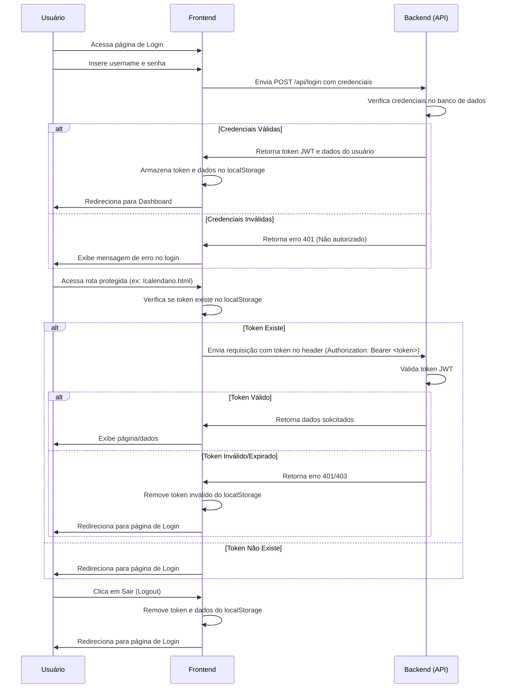

## 6. Regras de Autenticação e Controle de Acesso

### 6.1. Autenticação
- O sistema utiliza autenticação baseada em token
- Tokens são armazenados no localStorage do navegador
- Todas as requisições à API (exceto login e registro) requerem token de autenticação
- Tokens são enviados no cabeçalho Authorization como Bearer token

### 6.2. Tipos de Usuário
- **Comum**: Usuários regulares que podem criar e gerenciar seus próprios agendamentos
- **Admin**: Administradores com acesso a todas as funcionalidades do sistema

### 6.3. Controle de Acesso
- Páginas e funcionalidades administrativas são restritas a usuários do tipo admin
- Usuários comuns só podem visualizar e modificar seus próprios agendamentos
- Administradores podem visualizar e modificar todos os agendamentos
- Apenas administradores podem gerenciar usuários, laboratórios e turmas
- Verificação de permissões é realizada tanto no frontend quanto no backend

### 6.4. Fluxo de Autenticação (Diagrama Simplificado)



**Descrição do Fluxo:**

1.  **Login**: O usuário fornece credenciais na interface de login. O frontend envia essas credenciais para a rota `/api/login`.
2.  **Validação**: O backend verifica as credenciais no banco de dados.
3.  **Geração do Token**: Se as credenciais forem válidas, o backend gera um token JWT (JSON Web Token) contendo informações do usuário (como ID e tipo) e uma assinatura secreta.
4.  **Armazenamento**: O frontend recebe o token e os dados do usuário, armazenando-os no `localStorage` do navegador.
5.  **Requisições Protegidas**: Para acessar rotas protegidas, o frontend recupera o token do `localStorage` e o envia no cabeçalho `Authorization` de cada requisição à API.
6.  **Validação do Token**: O backend intercepta cada requisição, extrai o token do cabeçalho e valida sua assinatura e expiração. Se o token for válido, a requisição é processada; caso contrário, um erro de autenticação (401 ou 403) é retornado.
7.  **Logout**: Ao clicar em sair, o frontend remove o token e os dados do usuário do `localStorage`, efetivamente desconectando o usuário.

### 6.5. Fluxos de Uso do Sistema

#### 6.5.1. Fluxo de Usuário Comum

1.  **Login**: O usuário acessa a página de login (`admin-login.html`) e insere suas credenciais.
2.  **Dashboard**: Após o login bem-sucedido, é redirecionado para o Dashboard (`index.html`), onde visualiza seus próximos agendamentos e notificações.
3.  **Novo Agendamento**: Clica em "Novo Agendamento" no menu.
4.  **Preenchimento**: Na página `novo-agendamento.html`, seleciona data, laboratório, turma, turno e horários disponíveis.
5.  **Salvar**: Clica em "Salvar Agendamento". O frontend envia os dados para `POST /api/agendamentos`.
6.  **Confirmação**: Recebe uma mensagem de sucesso e é redirecionado para o calendário ou dashboard.
7.  **Consulta Calendário**: Acessa a página `calendario.html` para visualizar seus agendamentos e os de outros usuários (com cores por turno).
8.  **Detalhes**: Clica em um agendamento no calendário para ver detalhes em um modal.
9.  **Logout**: Clica em "Sair" no menu dropdown do usuário.

#### 6.5.2. Fluxo de Usuário Administrador

1.  **Login**: O administrador acessa a página de login (`admin-login.html`) e insere suas credenciais de admin.
2.  **Dashboard**: É redirecionado para o Dashboard (`index.html`).
3.  **Gerenciar Usuários**: Acessa a página `usuarios.html` pelo menu.
4.  **Ações de Usuário**: Visualiza a lista de usuários, podendo editar ou excluir existentes, ou adicionar novos usuários.
5.  **Gerenciar Laboratórios/Turmas**: Acessa a página `laboratorios-turmas.html` pelo menu.
6.  **Ações de Lab/Turma**: Cadastra novos laboratórios ou turmas, ou edita/exclui existentes.
7.  **Consulta Calendário**: Acessa `calendario.html` e visualiza todos os agendamentos do sistema, podendo filtrar por laboratório ou turno.
8.  **Detalhes/Edição/Exclusão**: Clica em qualquer agendamento para ver detalhes, editar ou excluir (mesmo que não seja seu).
9.  **Logout**: Clica em "Sair".

## 7. Lógica de Cores por Turno no Calendário

(Seção existente - manter)

## 8. Explicação dos Scripts JS Principais (`app.js`)

O arquivo `src/static/js/app.js` contém a lógica JavaScript principal compartilhada entre as páginas do frontend. Suas responsabilidades incluem:

- **Verificação de Autenticação (`verificarAutenticacao`)**: Executada no carregamento de cada página protegida. Verifica se existe um token válido no `localStorage`. Se não houver ou for inválido, redireciona para a página de login. Também armazena os dados do usuário logado.
- **Controle de Visibilidade por Tipo de Usuário**: Após a autenticação, o script verifica o tipo de usuário (`admin` ou `comum`) armazenado. Elementos HTML com a classe `admin-only` são ocultados para usuários comuns e exibidos para administradores. Isso é feito dinamicamente, inclusive monitorando o DOM para garantir que menus carregados posteriormente também tenham a visibilidade ajustada.
- **Comunicação com a API (`chamarAPI`)**: Uma função wrapper para `fetch` que simplifica as chamadas à API REST do backend. Ela automaticamente:
    - Adiciona o token de autenticação (Bearer) ao cabeçalho `Authorization`.
    - Define o `Content-Type` como `application/json` para requisições POST/PUT.
    - Converte o corpo da requisição para JSON.
    - Trata as respostas, convertendo o JSON de sucesso ou lançando um erro com a mensagem da API em caso de falha.
- **Renderização Dinâmica (Ex: Calendário)**: Scripts específicos em cada página (como `calendario.html`) utilizam `chamarAPI` para buscar dados (ex: agendamentos) e então manipulam o DOM para renderizar esses dados dinamicamente (ex: preenchendo a grade do calendário, adicionando eventos).
- **Aplicação das Cores por Turno (`getClasseTurno`)**: Uma função auxiliar que recebe o nome do turno ("Manhã", "Tarde", "Noite") e retorna a classe CSS correspondente (`agendamento-manha`, `agendamento-tarde`, `agendamento-noite`). Essa função é usada ao renderizar agendamentos no calendário e em listas para aplicar a cor correta.
- **Manipulação de Formulários**: Captura de dados de formulários, envio para a API via `chamarAPI` e tratamento de respostas (sucesso ou erro).
- **Exibição de Alertas (`exibirAlerta`)**: Função para mostrar mensagens de feedback (sucesso, erro, aviso) ao usuário de forma padronizada usando componentes de alerta do Bootstrap.
- **Logout (`logout`)**: Remove os dados de autenticação do `localStorage` e redireciona para a página de login.

## 9. Tratamento de Erros e Mensagens de Validação

O sistema implementa tratamento de erros tanto no backend quanto no frontend.

### 9.1. Erros da API (Backend)

A API retorna códigos de status HTTP e mensagens JSON padronizadas para indicar erros:

- **400 Bad Request**: Dados inválidos ou faltando na requisição.
    - Exemplo Payload: `{"erro": "Campo 'nome' é obrigatório"}`
    - Exemplo Payload: `{"erro": "Formato de data inválido. Use YYYY-MM-DD"}`
- **401 Unauthorized**: Falha na autenticação (token inválido, expirado ou não fornecido).
    - Exemplo Payload: `{"erro": "Token inválido ou expirado"}`
    - Exemplo Payload: `{"erro": "Credenciais inválidas"}` (no login)
- **403 Forbidden**: Usuário autenticado, mas sem permissão para acessar o recurso.
    - Exemplo Payload: `{"erro": "Acesso negado. Requer privilégios de administrador."}`
- **404 Not Found**: Recurso solicitado não encontrado (ex: agendamento com ID inexistente).
    - Exemplo Payload: `{"erro": "Agendamento não encontrado"}`
- **409 Conflict**: Conflito ao tentar criar um recurso que já existe ou viola uma regra.
    - Exemplo Payload: `{"erro": "Horário já reservado neste laboratório e data"}`
    - Exemplo Payload: `{"erro": "Username já cadastrado"}`
- **500 Internal Server Error**: Erro inesperado no servidor.
    - Exemplo Payload: `{"erro": "Erro interno do servidor"}`

### 9.2. Tratamento no Frontend

O frontend (via `app.js` e scripts específicos das páginas) trata esses erros da seguinte forma:

- **Alertas Visuais**: A função `exibirAlerta` é usada para mostrar mensagens de erro retornadas pela API em um componente de alerta do Bootstrap, geralmente no topo da página ou próximo ao formulário.
- **Redirecionamento para Login**: Em caso de erros 401 ou 403 (falha de autenticação ou permissão), o usuário é automaticamente redirecionado para a página de login após remover o token inválido do `localStorage`.
- **Destaque de Campos (Validação)**: Embora a validação principal ocorra no backend, o frontend pode implementar validações básicas (ex: campos obrigatórios) e destacar visualmente os campos com erro nos formulários.
- **Mensagens em Modais**: Erros específicos de operações em modais (como exclusão) podem ser exibidos dentro do próprio modal.

## 10. Boas Práticas de Segurança Aplicadas

Diversas medidas de segurança foram implementadas no sistema:

1.  **Hash de Senhas**: As senhas dos usuários nunca são armazenadas em texto plano. A biblioteca `Werkzeug` é utilizada no backend para gerar hashes seguros (atualmente usando `pbkdf2:sha256`) das senhas antes de salvá-las no banco de dados. A função `check_password_hash` é usada para verificar a senha durante o login sem precisar descriptografar o hash.
2.  **Validação e Sanitização de Entrada**: Todos os dados recebidos pela API (backend) são validados para garantir que estão no formato esperado e que campos obrigatórios estão presentes. Embora não haja sanitização explícita para HTML (pois a API retorna JSON), a validação previne muitos tipos de ataques de injeção. O uso de ORM (SQLAlchemy) também ajuda a prevenir injeção SQL, pois parametriza as queries.
3.  **Autenticação Baseada em Token (JWT)**: O uso de JSON Web Tokens (JWT) para autenticação stateless evita a necessidade de gerenciar sessões no servidor. Os tokens contêm um payload com informações do usuário e uma assinatura digital que garante sua integridade e autenticidade. O backend valida a assinatura em cada requisição.
4.  **HTTPS (Recomendado em Produção)**: Embora não forçado em desenvolvimento, é crucial configurar um servidor web (como Nginx ou Apache) para usar HTTPS em produção. Isso criptografa toda a comunicação entre o cliente e o servidor, protegendo os tokens e os dados transmitidos.
5.  **Controle de Acesso Baseado em Roles (Tipo de Usuário)**: O backend verifica o tipo de usuário (presente no token JWT) antes de permitir o acesso a rotas administrativas (ex: gerenciamento de usuários, laboratórios, turmas). Decorators `@admin_required` podem ser usados para proteger essas rotas.
6.  **Armazenamento de Tokens no `localStorage`**: O token JWT é armazenado no `localStorage` do navegador. 
    *   **Vantagem**: Simples e permite que o usuário permaneça logado entre sessões.
    *   **Risco**: Vulnerável a ataques de Cross-Site Scripting (XSS). Se um invasor conseguir injetar script malicioso na página, ele pode ler o token do `localStorage` e sequestrar a sessão do usuário. Medidas para mitigar XSS (validação de entrada, Content Security Policy) são importantes.
    *   **Alternativa**: `sessionStorage` (token perdido ao fechar aba/navegador) ou Cookies HTTPOnly (mais seguros contra XSS, mas requerem proteção CSRF).
7.  **Cabeçalhos de Segurança**: Em produção, configurar o servidor web para enviar cabeçalhos de segurança como `Content-Security-Policy`, `X-Content-Type-Options`, `X-Frame-Options`, `Referrer-Policy` e `Strict-Transport-Security` adiciona camadas extras de proteção.
8.  **CORS (Cross-Origin Resource Sharing)**: O Flask (com a extensão Flask-CORS, se usada) pode ser configurado para permitir requisições apenas de origens confiáveis (o domínio do frontend), prevenindo que outros sites façam requisições maliciosas à API em nome do usuário.

## 11. Teste do Sistema

Para garantir o correto funcionamento do sistema, realize os seguintes testes localmente:

1.  **Login/Logout**:
    - Tente fazer login com credenciais válidas (admin/admin123 e um usuário comum criado).
    - Tente fazer login com credenciais inválidas (usuário/senha errados).
    - Verifique se o logout funciona corretamente (redireciona para login, remove token).
2.  **Agendamentos (Usuário Comum)**:
    - Crie um novo agendamento, preenchendo todos os campos.
    - Verifique se o agendamento aparece no calendário com a cor correta do turno.
    - Edite um agendamento existente.
    - Exclua um agendamento.
    - Tente criar um agendamento em um horário/laboratório já ocupado (deve dar erro).
3.  **Gerenciamento (Administrador)**:
    - **Usuários**: Crie, edite e exclua um usuário comum.
    - **Laboratórios**: Adicione, edite e exclua um laboratório.
    - **Turmas**: Adicione, edite e exclua uma turma.
    - Verifique se os novos laboratórios/turmas aparecem como opções no formulário de agendamento.
4.  **Permissões**:
    - Logado como usuário comum, tente acessar URLs administrativas (ex: `/usuarios.html`, `/laboratorios-turmas.html`). Deve ser redirecionado para o login ou receber um erro.
    - Logado como usuário comum, tente executar ações de admin via API (ex: deletar outro usuário) usando ferramentas como `curl` ou Postman (deve receber erro 403).
    - Logado como admin, verifique se consegue editar/excluir agendamentos de outros usuários.
5.  **Calendário e Filtros**:
    - Navegue entre os meses no calendário.
    - Aplique filtros de laboratório e turno e verifique se os resultados são filtrados corretamente.
    - Verifique a legenda de cores e os tooltips.
6.  **Responsividade**: Teste a interface em diferentes tamanhos de tela (desktop, tablet, mobile) usando as ferramentas de desenvolvedor do navegador.

## 12. Checklist de Deploy em Produção

Ao mover o sistema do ambiente de desenvolvimento local para um servidor de produção, siga este checklist:

1.  **Servidor**: Provisionar um servidor (VPS, Cloud Instance, etc.) com sistema operacional Linux recomendado (Ubuntu, CentOS).
2.  **Banco de Dados**: 
    - Instalar e configurar um servidor de banco de dados MySQL.
    - Criar um banco de dados específico para a aplicação (ex: `agenda_lab_prod`).
    - Criar um usuário MySQL dedicado para a aplicação com permissões apenas para esse banco de dados.
    - Anotar as credenciais (host, porta, nome do banco, usuário, senha).
3.  **Código Fonte**: Transferir o código-fonte do projeto para o servidor (via Git, SCP, etc.).
4.  **Ambiente Python**: 
    - Instalar Python 3.11+ no servidor.
    - Criar e ativar um ambiente virtual (`venv`).
    - Instalar as dependências: `pip install -r requirements.txt`.
5.  **Configuração da Aplicação (`src/main.py`)**:
    - **Descomentar e configurar a URI do MySQL**: Atualize a linha `app.config['SQLALCHEMY_DATABASE_URI']` com as credenciais do banco de dados de produção.
    - **Variáveis de Ambiente**: É **altamente recomendado** usar variáveis de ambiente para configurar dados sensíveis (URI do banco, `SECRET_KEY`). Utilize um arquivo `.env` e a biblioteca `python-dotenv` (já inclusa) ou as configurações do sistema operacional/servidor de aplicação.
    - **SECRET_KEY**: Definir uma `SECRET_KEY` forte e única para o Flask (usada para assinar tokens, sessões, etc.). Gere uma chave aleatória segura.
    - **DEBUG Mode**: **Desativar** o modo debug do Flask: `app.run(debug=False)` (ou remova o parâmetro `debug`). O modo debug nunca deve ser usado em produção.
6.  **WSGI Server**: 
    - **Não use** o servidor de desenvolvimento do Flask (`app.run()`) em produção.
    - Instale um servidor WSGI robusto, como `Gunicorn` ou `uWSGI`: `pip install gunicorn`.
    - Execute a aplicação usando o servidor WSGI. Exemplo com Gunicorn:
      ```bash
      gunicorn --bind 0.0.0.0:5000 src.main:app 
      # (Ajuste a porta e adicione workers conforme necessário: --workers 4)
      ```
7.  **Web Server (Reverse Proxy)**:
    - Instale e configure um web server como `Nginx` ou `Apache` para atuar como reverse proxy.
    - Configure o web server para:
        - Receber requisições na porta 80 (HTTP) e/ou 443 (HTTPS).
        - Redirecionar requisições para o servidor WSGI (ex: Gunicorn na porta 5000).
        - Servir os arquivos estáticos (`src/static/`) diretamente (mais eficiente).
        - Configurar cabeçalhos de segurança.
8.  **HTTPS**: 
    - Obtenha um certificado SSL/TLS (ex: Let's Encrypt - gratuito).
    - Configure o web server (Nginx/Apache) para usar o certificado e habilitar HTTPS (porta 443).
    - Configure o redirecionamento de HTTP para HTTPS.
9.  **Firewall**: Configure o firewall do servidor (ex: `ufw` no Ubuntu) para permitir tráfego apenas nas portas necessárias (80, 443, SSH).
10. **Monitoramento e Logs**: Configure a rotação de logs da aplicação e do servidor web. Considere usar ferramentas de monitoramento para acompanhar a performance e a disponibilidade.
11. **Backup**: Implemente uma rotina de backup regular para o banco de dados e o código-fonte.

## 13. Glossário Técnico

- **API (Application Programming Interface)**: Conjunto de regras e protocolos que permite que diferentes softwares se comuniquem entre si. No projeto, a API RESTful permite a comunicação entre o frontend e o backend.
- **Backend**: A parte do sistema que roda no servidor, responsável pela lógica de negócios, acesso ao banco de dados e processamento das requisições da API.
- **Bootstrap**: Framework CSS popular que fornece componentes de interface e um sistema de grid responsivo para facilitar o desenvolvimento frontend.
- **CRUD**: Acrônimo para as quatro operações básicas de persistência de dados: Create (Criar), Read (Ler), Update (Atualizar) e Delete (Excluir).
- **CSS (Cascading Style Sheets)**: Linguagem usada para descrever a apresentação e o estilo de um documento escrito em HTML.
- **Deploy**: O processo de colocar uma aplicação em um ambiente de produção, tornando-a acessível aos usuários finais.
- **Flask**: Microframework web para Python, usado para construir o backend e a API do sistema.
- **Frontend**: A parte do sistema com a qual o usuário interage diretamente, geralmente rodando no navegador. Inclui HTML, CSS e JavaScript.
- **Git**: Sistema de controle de versão distribuído, usado para gerenciar o histórico do código-fonte.
- **Hash**: Resultado de uma função matemática que transforma uma entrada (ex: senha) em uma string de tamanho fixo. É unidirecional (não pode ser revertido) e usado para armazenar senhas de forma segura.
- **HTML (HyperText Markup Language)**: Linguagem de marcação padrão para criar páginas web.
- **HTTP (Hypertext Transfer Protocol)**: Protocolo de comunicação usado para transferir dados na World Wide Web.
- **HTTPS (HTTP Secure)**: Versão segura do HTTP que usa criptografia SSL/TLS para proteger a comunicação.
- **JavaScript (JS)**: Linguagem de programação que permite adicionar interatividade e dinamismo às páginas web.
- **JSON (JavaScript Object Notation)**: Formato leve de troca de dados, amplamente utilizado em APIs web.
- **JWT (JSON Web Token)**: Padrão aberto (RFC 7519) para criar tokens de acesso que afirmam algumas informações (claims). Usado para autenticação stateless.
- **LocalStorage**: Mecanismo de armazenamento no navegador que permite que sites salvem dados chave-valor localmente, persistindo mesmo após fechar o navegador.
- **MySQL**: Sistema de gerenciamento de banco de dados relacional popular.
- **ORM (Object-Relational Mapping)**: Técnica que converte dados entre sistemas de tipos incompatíveis em programação orientada a objetos. No projeto, Flask-SQLAlchemy mapeia objetos Python para tabelas do banco de dados.
- **Payload**: Os dados reais transmitidos em uma requisição ou resposta de API, geralmente em formato JSON.
- **Pip**: Gerenciador de pacotes padrão para Python.
- **Python**: Linguagem de programação de alto nível, interpretada, usada no backend.
- **REST (Representational State Transfer)**: Estilo arquitetural para projetar APIs web, baseado em princípios como statelessness, recursos e operações HTTP padrão (GET, POST, PUT, DELETE).
- **SQLite**: Banco de dados relacional leve que armazena o banco de dados inteiro em um único arquivo, ideal para desenvolvimento e aplicações simples.
- **SQLAlchemy**: Biblioteca ORM para Python.
- **Token**: Uma pequena peça de dado usada para autenticação ou autorização. No projeto, um JWT é usado como token de autenticação.
- **UI (User Interface)**: A interface gráfica com a qual o usuário interage.
- **URL (Uniform Resource Locator)**: Endereço único usado para localizar um recurso na internet.
- **venv**: Módulo Python para criar ambientes virtuais isolados.
- **WSGI (Web Server Gateway Interface)**: Especificação padrão que descreve como um servidor web se comunica com aplicações web Python.

## 14. Exemplos de Payloads JSON da API

Estes são exemplos de corpos JSON esperados para requisições POST e PUT.

### 14.1. Login (`POST /api/login`)
```json
{
  "username": "usuario_teste",
  "senha": "senha123"
}
```

### 14.2. Criar Usuário (`POST /api/usuarios`)
```json
{
  "nome": "Nome Completo do Usuário",
  "email": "usuario@exemplo.com",
  "username": "usuario_novo",
  "senha": "senhaForte123!",
  "tipo": "comum" 
}
```

### 14.3. Atualizar Usuário (`PUT /api/usuarios/{id}`)
```json
{
  "nome": "Nome Atualizado",
  "email": "email_atualizado@exemplo.com",
  "tipo": "admin" 
}
```
*(Nota: A senha e o username geralmente não são atualizados nesta rota ou requerem rotas separadas)*

### 14.4. Criar Agendamento (`POST /api/agendamentos`)
```json
{
  "data": "2025-07-15",
  "laboratorio": "Lab 01",
  "turma": "Turma A",
  "turno": "Tarde",
  "horarios": "[\"14:00-15:00\", \"15:00-16:00\"]" 
}
```
*(Nota: `horarios` é uma string JSON)*

### 14.5. Atualizar Agendamento (`PUT /api/agendamentos/{id}`)
```json
{
  "data": "2025-07-16",
  "laboratorio": "Lab 02",
  "turma": "Turma B",
  "turno": "Manhã",
  "horarios": "[\"09:00-10:00\"]" 
}
```

### 14.6. Criar Laboratório (`POST /api/laboratorios`)
```json
{
  "nome": "Laboratório de Química Avançada"
}
```

### 14.7. Atualizar Laboratório (`PUT /api/laboratorios/{id}`)
```json
{
  "nome": "Laboratório de Química Geral"
}
```

### 14.8. Criar Turma (`POST /api/turmas`)
```json
{
  "nome": "Engenharia de Software 2025.1"
}
```

### 14.9. Atualizar Turma (`PUT /api/turmas/{id}`)
```json
{
  "nome": "Engenharia de Software 2025.2"
}
```

## 15. Conclusão

(Seção existente - manter)

